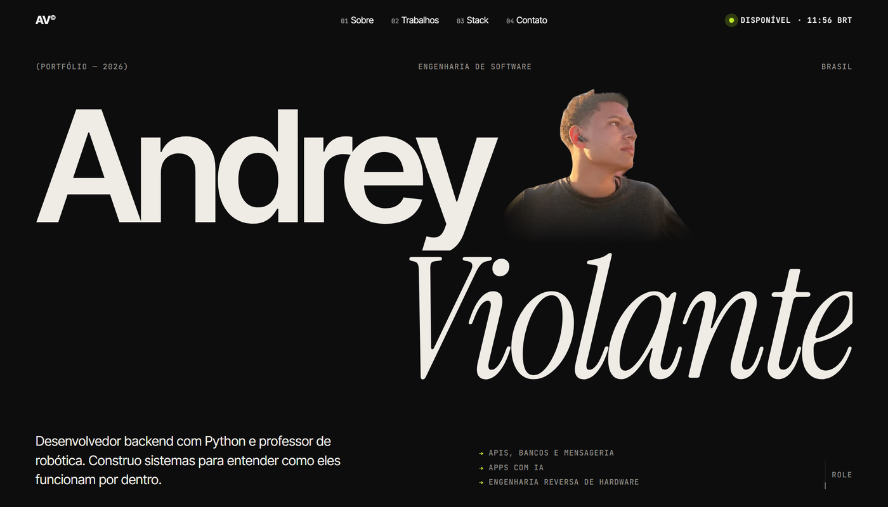
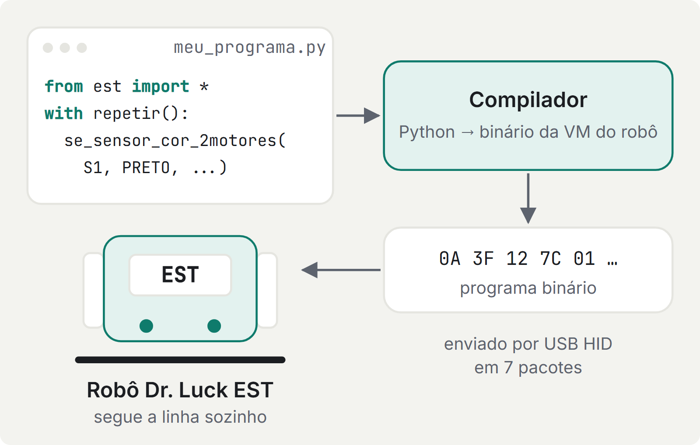

## Olá, eu sou o Andrey 👋

Estudante de Engenharia de Software, focado em **backend com Python**, e professor de robótica.
Aprendo construindo: APIs com mensageria, apps Android nativos e até a engenharia reversa
do protocolo de um robô educacional que não tinha documentação nenhuma.

No momento estou estudando arquiteturas com mensageria (RabbitMQ/Kafka) e serviços em containers.

## 🌐 Conheça meu portfólio

  

## ⭐ Projetos principais

<h2 align="center">🗣️ <a href="https://englishtutor-weld.vercel.app">Hi, Kiara!</a></h2>

  

Assistente virtual de prática de inglês para alunos do 6º ao 9º ano. A **Kiara**, uma personagem animada,
conversa com o aluno por **texto e voz**: reconhecimento de fala para ouvir o aluno, voz sintetizada para responder.
A conversa se adapta ao ano escolar, ao nível e aos tópicos de gramática escolhidos.

O método é **socrático**: em vez de entregar a resposta, a Kiara devolve uma pergunta que leva o aluno a chegar nela.
Como o público é menor de idade, o comportamento da IA tem limites de segurança explícitos.
O código é privado, mas o app está aberto no link.

  

React Native · Expo · TypeScript · LLM · Reconhecimento de voz · Síntese de voz

<h2 align="center">🤖 <a href="https://github.com/AndreyViolante/Est-Robot">Est-Robot</a></h2>

  <picture>
    <source media="(prefers-color-scheme: dark)" srcset="assets/est-robot-dark.png">
    
  </picture>

O robô educacional **Dr. Luck EST** só podia ser programado por uma IDE fechada e sem nenhuma documentação pública.
Capturei e analisei o tráfego USB, mapeei o **protocolo HID** e o formato binário dos programas, e escrevi um
**compilador** que transforma scripts Python no código que a máquina virtual do robô executa.

Resultado: o robô passa a ser programado em Python puro, sem depender da IDE proprietária. Uso o projeto
nas aulas de robótica e na preparação da equipe para a OBR.

  

Python · Engenharia reversa · HID/USB · Compiladores · Robótica

## Outros projetos

<h3 align="center">💰 <a href="https://github.com/AndreyViolante/Finance-Ai">Finance-Ai</a></h3>

<picture>
  <source media="(prefers-color-scheme: dark)" srcset="assets/flow-finance-ai-dark.png">
  
</picture>

App Android de finanças pessoais que registra os gastos sozinho: lê as notificações de compra do banco,
extrai o valor e monta um painel com renda, despesas fixas, saldo livre e meta de economia. Os dados ficam só no celular.

React Native · Expo · TypeScript · Java · MMKV

<h3 align="center">📱 <a href="https://github.com/AndreyViolante/RegionWatcher">RegionWatcher</a></h3>

<picture>
  <source media="(prefers-color-scheme: dark)" srcset="assets/flow-regionwatcher-dark.png">
  
</picture>

App Android que vigia uma área da tela e avisa quando ela muda, usando captura via MediaProjection
e comparação por hash perceptual (dHash).

Kotlin · Jetpack Compose · Foreground Service

<h3 align="center">🎓 <a href="https://github.com/AndreyViolante/Moodle-Assistente">Moodle-Assistente</a></h3>

<picture>
  <source media="(prefers-color-scheme: dark)" srcset="assets/flow-moodle-assistente-dark.png">
  
</picture>

Assistente de desktop para o AVA da faculdade. Consulta a API do Moodle, ordena as entregas por urgência,
avisa por notificação do Windows quando um prazo se aproxima e abre um tutor com IA que já leu o enunciado e os PDFs da atividade.

Python · API REST · CustomTkinter · Gemini

## Tecnologias

---

Aberto a oportunidades de **estágio** e **backend júnior**. Me chama no [LinkedIn](https://linkedin.com/in/andrey-violante).
